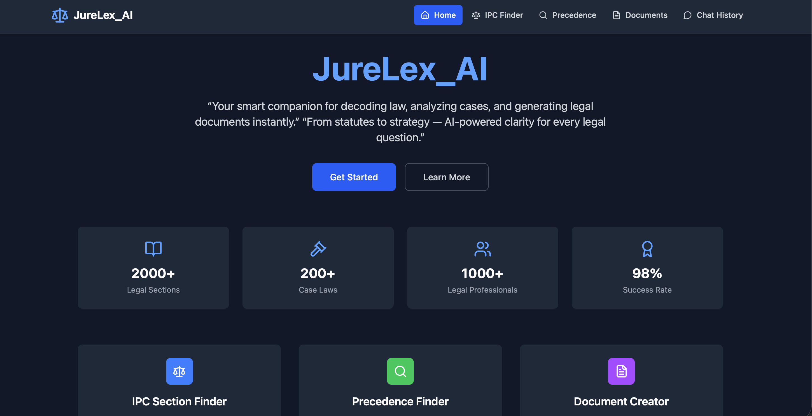

# Legal Chatbot



## Overview

🚀 Overview
JureLex AI is an intelligent, AI-powered legal assistant designed to simplify and accelerate legal research, document creation, and case analysis within the Indian legal domain.
Leveraging a robust combination of Retrieval-Augmented Generation (RAG), semantic search, and vector-based retrieval, the system delivers highly accurate, context-aware legal responses rather than generic chatbot outputs.
At its core, the platform utilizes Milvus as a high-performance vector database for indexing and retrieving legal documents, while Ollama (Llama 3.2 – 1B parameters) powers the natural language understanding and response generation. This integration enables the system to interpret complex legal queries and generate structured, meaningful outputs in real time.
The application features a modern and responsive user interface built with React and Vite, seamlessly connected to a scalable Flask-based backend, ensuring efficient processing and smooth user interaction.
💡 Built as a production-oriented AI system, combining cutting-edge NLP techniques with real-world legal use cases.

The frontend is developed using React and Vite, while the backend is built using Flask. 

## Features

1. **Smart IPC/BNS Legal Intelligence**: Understands and interprets user queries about Indian penal laws using natural language processing
Dynamically retrieves the most relevant legal sections with clear, concise explanations
Bridges the gap between IPC and BNS frameworks, ensuring modern legal relevance
2. **📄 AI-Powered Legal Document Generation**: The chatbot can help in drafting various legal documents, such as contracts, agreements, and notices, by guiding the user through the necessary inputs.
3. **⚖️ Advanced Case Law & Precedent Discovery**: Performs intelligent retrieval of relevant judicial precedents from legal datasets
Provides case summaries, citations, and interpretative insights
Helps users understand legal reasoning, applicability, and real-world implications


## Tech Stack

- **Frontend**: React, Vite
- **Backend**: Flask
- **Semantic Search**: Retrieval-Augmented Generation (RAG) with Milvus vector database
- **LLM**: Ollama (Llama 3.2 with 1B parameters)

## ⚙️ How It Works

🔍 Intelligent Query Processing
The user submits a query through the frontend interface, which is seamlessly routed to the Flask backend. The system preprocesses and structures the query to capture intent and context effectively.

🧠 Semantic Retrieval via Vector Search
The processed query is transformed into embeddings and matched against a Milvus-powered vector database. Using advanced semantic search, the system retrieves the most relevant legal information — including IPC/BNS sections, case precedents, and document data.

🤖 Context-Aware LLM Generation
The retrieved context is passed to the Ollama-powered LLM (Llama 3.2), which synthesizes the information and generates a coherent, accurate, and legally meaningful response tailored to the user’s query.

💻 Seamless Frontend Delivery
The final response is delivered back to the React frontend and presented in a clean, structured, and user-friendly format, ensuring clarity and ease of understanding.

## Requirements

- Python 3.8 or higher
- Node.js (for React and Vite)
- Milvus (for vector storage)
- Ollama LLM
- Flask
 
## Project Structure
JureLex_AI/
│
├── backend/              # Flask backend
├── frontend/             # React frontend
├── case_files/           # Legal case PDFs
├── images/               # UI & demo assets
├── create_collections.py
├── precedence_collections.py
├── requirements.txt
└── README.md
## Setup

1. Clone the repository:

    ```bash
    git clone https://github.com/Ishitachauhann/JureLex_AI.git cd JureLex_AI
    ```

2. Create and activate a virtual environment:

    ```bash
    python3 -m venv venv
    source venv/bin/activate  # On Windows, use `venv\Scripts\activate`
    ```

3. Install backend dependencies:

    ```bash
    pip install -r requirements.txt
    ```
4. If the previous one doesnt work and if you face anyy dependancy issues

    ```bash
    pip install -r requirements1.txt
    ```

### Milvus Setup
    ```
 Run the create_collections.py file 2 times, once with "./IPC.pdf" as the path and once more with "./documentforms.pdf" as the path   

1. Run the script to make collections on the vector database.
    ```bash
    create_collections.py
    ```
2. Then run precedance_collections.py file with "./case_files" as the path 

#### By doing steps 1 and 2:
Converts legal data → embeddings
Stores them in Milvus 

### Backend Setup (Flask)

1. Start the Flask backend:

    ```bash
    cd backend
    python app.py
    ```

   The backend server will be running on `http://localhost:5173`.

### Frontend Setup (React + Vite)

1. Install frontend dependencies:

    ```bash
    cd frontend
    npm install
    ```

2. Run the frontend development server:

    ```bash
    npm run dev
    ```

   The frontend will be available at `http://localhost:5173`.

## Usage

- **IPC Section Queries**: To inquire about a specific section of the Indian Penal Code, simply type the section number or describe your query. For example: “What is Section 302 of the IPC?” The system retrieves and presents:
Relevant legal sections
Clear and concise explanations
Contextual understanding of the provision

- **Legal Document Creation**: TGenerate structured legal documents such as:
Agreements
Contracts
Affidavits
Provide a detailed prompt to ensure accuracy and completeness
Example: Rental Agreement Input Should Include:
Names of involved parties (Landlord & Tenant)
Property address
Terms (rent, deposit, etc.)
Duration of agreement
Special clauses (maintenance, restrictions, etc.)
✔ Output:
Professionally formatted
Ready-to-use and editable document

- **Precedent Search**: Search for relevant legal precedents by describing:
Case facts
Legal issue
The system returns:
Relevant case laws
Summaries and citations
Insights into judicial interpretation

## Future Enhancements 
🔄 Real-time legal database updates
⚖️ Full integration with Bharatiya Nyaya Sanhita (BNS)
🌐 Multi-language legal support
🎙️ Voice-enabled legal assistant
☁️ Cloud deployment (AWS / GCP) for scalability

## Contributing
Contributions are welcome and appreciated!
Fork the repository
Create a new feature branch
Commit your changes with clear messages
Submit a pull request
Please ensure your code is clean, well-documented, and follows project standards.

## License

This project is licensed under the MIT License - see the [LICENSE](LICENSE) file for details.
