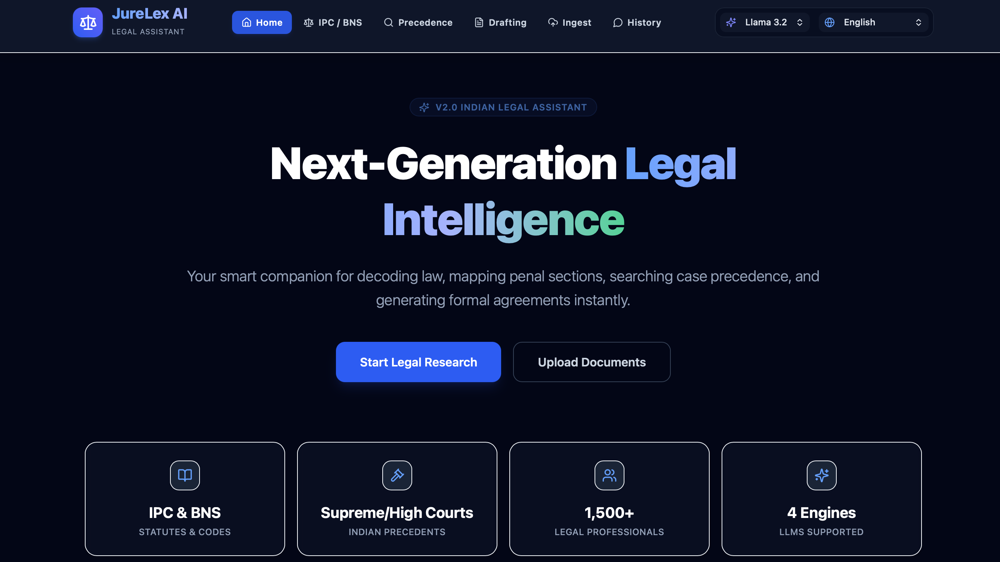

# JureLex_AI - Intelligent Indian Legal Assistant




**JureLex AI** is an enterprise-grade, intelligent AI-powered legal assistant designed to simplify and accelerate legal research, document creation, and case analysis within the Indian legal domain.

Leveraging a robust combination of **Retrieval-Augmented Generation (RAG)**, semantic search, and vector-based retrieval, the system delivers highly accurate, context-aware legal responses with official citations rather than generic LLM hallucinations.

---

##  Features

### ⚖️ Smart BNS-to-IPC Statutory Mapping
*   **BNS Transition Alerts**: Tracks transitions between the legacy Indian Penal Code (IPC) and the new Bharatiya Nyaya Sanhita (BNS).
*   **Interactive Comparison Cards**: Automatically detects penal sections in queries and renders comparison layouts mapping old and new section numbers side-by-side.

### Real-time Knowledge Ingestion (No-Code Updates)
*   **Dynamic Document Uploader**: Ingest PDF files, scanned images, or TXT records directly through the UI.
*   **Automated OCR Fallback**: Integrated `pytesseract` to extract text from scanned documents or image attachments automatically.
*   **Instant RAG Update**: Chunks text, computes embeddings using `SentenceTransformer (all-MiniLM-L6-v2)`, and inserts them into the Milvus vector database in real-time.

###  Multi-Language Translation
*   **Regional Language Queries**: Fully translate queries in **Hindi (हिन्दी), Tamil (தமிழ்), Telugu (తెలుగు), Bengali (বাঙালি), or Marathi (मराठी)**.
*   **Bidirectional Translators**: Translates regional input into English for semantic vector database retrieval and translates the generated English answer back into the query's native tongue.

###  Hands-Free Dictation & Voice Narration
*   **Speech-to-Text Input**: Use the browser's native Web Speech API to transcribe user voice inputs in real-time.
*   **Polished Female Narration**: Features a customized TTS selector prioritizing clear, premium female voices (like `Samantha`, `Sangeeta`, `Zira`) while blacklisting robotic male fallbacks (like `Alex` or `Fred`).

### ⚡ Performance & Failover Architecture
*   **Model Routing Selector**: Select Llama 3, Phi, Mistral, or Gemini on-the-fly. The backend runs only the selected model, preventing local CPU/GPU thrashing.
*   **Lazy DB Initializer**: Prevents Flask boot crashes if Milvus is starting up or temporarily offline.

###  Production-Ready Cloud Deployment
*   **Docker Containerization**: Multi-container setup containing an Nginx frontend container and an OCR-configured Flask backend.
*   **Nginx Reverse Proxy**: Configured to route backend API requests smoothly and prevent CORS blocks.

---

##  Tech Stack

*   **Frontend**: React (Vite), Tailwind CSS, Lucide React, React Markdown
*   **Backend**: Flask, PyMuPDF (PDF parsing), Tesseract (OCR engine)
*   **Vector Store**: Milvus Vector Database
*   **Semantic Model**: `SentenceTransformer (all-MiniLM-L6-v2)` (384 dimensions)
*   **LLM Integration**: Local Ollama (`llama3`, `phi`, `mistral`) & Gemini API Fallbacks

---

##  Project Structure

```text
JureLex_AI/
├── app.py                     # Main Flask backend application (server)
├── bns_mapping.py             # IPC-to-BNS bidirectional translation dictionary & parser
├── create_collections.py      # Script to initialize local Milvus database collections
├── precedence_collections.py  # Script to index local precedence legal documents
├── populate_zilliz.py         # Script to initialize & upload all data to Zilliz Cloud database
├── requirements.txt           # Local Python dependency manifest (with PyTorch & local models)
├── requirements_prod.txt      # Production Python dependency manifest (lightweight, no PyTorch)
├── Dockerfile                 # Production Docker recipe for Flask backend (uses requirements_prod.txt)
├── docker-compose.prod.yml    # Production Compose orchestration config
├── venv110/                   # Local Python virtual environment
└── frontend/                  # React source files
    ├── src/                   # React components
    │   ├── App.jsx            # Main app container containing chat tabs & voice engines
    │   └── main.jsx           # App entry point
    ├── package.json           # Node project manifest
    ├── Dockerfile.frontend    # Docker recipe for frontend Nginx bundle
    └── nginx.conf             # Production Nginx reverse proxy configuration
```

---

##  Setup & Installation

### Option 1: Local Development Setup

#### 1. Clone the repository
```bash
git clone https://github.com/Ishitachauhann/JureLex_AI.git
cd JureLex_AI
```

#### 2. Create and activate a virtual environment
```bash
python3 -m venv venv110
source venv110/bin/activate  # On Windows, use `venv110\Scripts\activate`
```

#### 3. Install backend dependencies
Make sure you have system-level dependencies for PyMuPDF and OCR:
```bash
# On macOS (using Homebrew)
brew install tesseract

# On Debian/Ubuntu
sudo apt-get install tesseract-ocr
```
Then run:
```bash
pip install -r requirements.txt
```

#### 4. Configure Milvus Collections
*   **For Local Development** (using a local Milvus instance):
    ```bash
    # Create IPC & Document Template collections
    python create_collections.py
    
    # Create Precedence legal case files database
    python precedence_collections.py
    ```
*   **For Cloud Production** (using Zilliz Cloud):
    Ensure your Zilliz URI and token variables are set in your environment:
    ```bash
    export MILVUS_URI="https://in03-xxxxxxxx.cloud.zilliz.com"
    export MILVUS_TOKEN="username:password"
    python populate_zilliz.py
    ```

#### 5. Run the Backend Server
Start the Flask backend from the project root:
```bash
python app.py
```
The server runs on `http://localhost:5050` (bound to `0.0.0.0` for container compatibility).

#### 6. Run the Frontend Server
Open a new terminal session, navigate to the frontend folder, and start Vite:
```bash
cd frontend
npm install
npm run dev
```
The client dashboard will be available at `http://localhost:5173`.

---

### Option 2: Production Docker Compose Setup

Spin up the entire application (Frontend + Backend + Reverse Proxy + OCR services) in one command:

```bash
docker compose -f docker-compose.prod.yml up --build -d
```
*   **Frontend dashboard**: `http://localhost:80` (or `http://localhost`)
*   **Backend endpoints**: Routed internally by Nginx via `http://localhost/api/...`

---

## Ingestion & Querying Workflow

To ask questions about a specific document:
1. Navigate to the **Ingest** tab in the top navigation bar.
2. Select the **Target Collection**:
   * *Precedence Collection*: For judgment PDFs and case records.
   * *Criminal Code Collection*: For statutory codes (IPC/BNS).
   * *Drafting Collection*: For contract templates.
3. Drag and drop your file and click **Index Document**.
4. Go to the matching chat tab (**Judicial Precedence Finder**, **IPC / BNS Finder**, or **Legal Drafting Suite**) and submit your question. The system will retrieve relevant chunks directly from the uploaded file to formulate the response.

---

## ⚖️ License

This project is licensed under the MIT License - see the [LICENSE.txt](LICENSE.txt) file for details.
